```
█████████████████████████████████████  
█████████████████████████████████████  
████ ▄▄▄▄▄ █▀█ █▄▄▀▀ ▀▄█ █ ▄▄▄▄▄ ████  
████ █   █ █▀▀▀█ ▀▀ ████▄█ █   █ ████  
████ █▄▄▄█ █▀ █▀▀▄▀▀▄ ▀█ █ █▄▄▄█ ████  
████▄▄▄▄▄▄▄█▄▀ ▀▄█▄▀▄█ ▀ █▄▄▄▄▄▄▄████  
████ ▄ ▄ ▀▄  ▄▀▄▀▄ █ █▀ █ ▀ ▀▄█▄▀████  
████▄ ▄   ▄▄██▄█▀▄  ▄▄▀█ ▄▀  ▀█▀█████  
████ ▀▄▄█ ▄▄▄ ▄█▄▄▀▄▄█▀ ▀▀▀▀▀▄▄█▀████  
█████ ▀ ▄ ▄▄█▀  ▄██ █▄▄▀  ▄ ▀▄▄▀█████  
████▀▄  ▄▀▄▄█▄▀▄▀█▄▀▀ ▄ ▀▀▀ ▀▄ █▀████  
████ ██▄▄▄▄█▀▄▀█▀█▀▄▀█ ▀▄▄█▀██▄▀█████  
████▄███▄█▄█▀▄ █▄▀▄▄▀▄██ ▄▄▄ ▀   ████  
████ ▄▄▄▄▄ █▄█▄ ▄▄  ██▄  █▄█ ▄▄▀█████  
████ █   █ █ ▀█▄ ▀ ▄▄▀▀█ ▄▄▄▄▀ ▀ ████  
████ █▄▄▄█ █ ▄▀███▀▄▄▄▄▄ █▄▀  ▄ █████  
████▄▄▄▄▄▄▄█▄███▄█▄▄▄▄▄██▄█▄▄▄▄██████  
█████████████████████████████████████  
█████████████████████████████████████ 
``` 
# Lightbatis 是什么 ?

    lightbatis 是基于约定的命名规范和类型规范在 Mybatis 的基础上开发的，快速的、简洁的数据持久层工具包。

# 为什么会有 Lightbatis ?
传统的基于 Mybatis 的数据持久层，有以下的规律，先定义实体类，实体类有三分部分组成，XML 定义， Entity Bean 和表结构，如下图：  
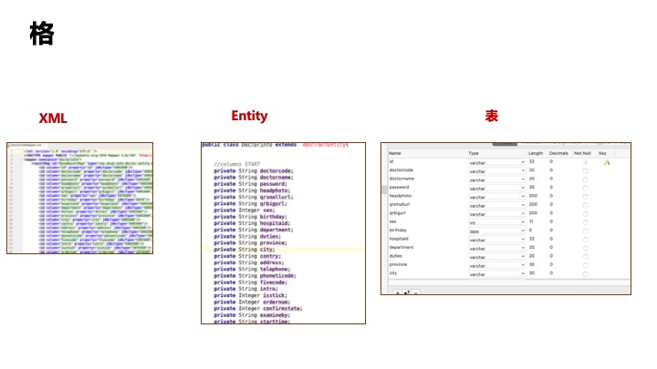  
进行数据访问的操作，也有三部分组成， Mapper XML 定义，Mapper 接口定义， Mapper 接口的实现，如下图：  
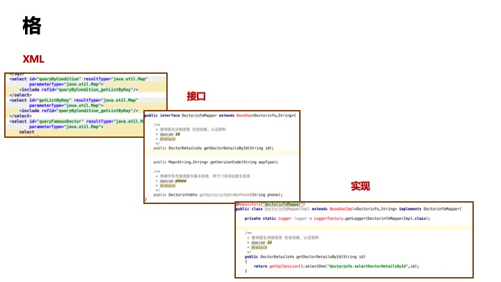    
其流程是，定义XML，Entity, 定义接口，实现接口，如下图：  
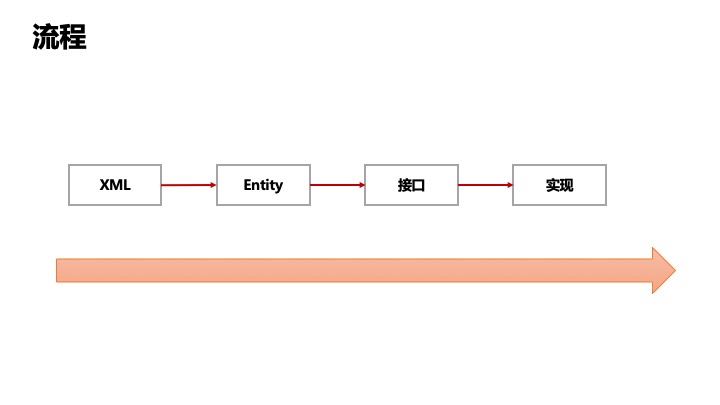  

我们真实需要什么呢？ 其实无非我们需要一个"存数据的地方" 和一个"访问数据的方法"，如下图：

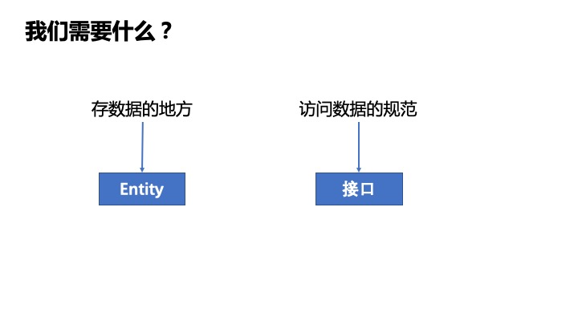  

我们希望我们的程序员更多关注在数据库设计、应用设计和架构设计上，为应用创造更多价值，少去做重复的工作，生活其实可以更美好，我们大胆地去掉了XML,和接口实现这两步，使用 Proxy 去代理，于是就有了以下：  

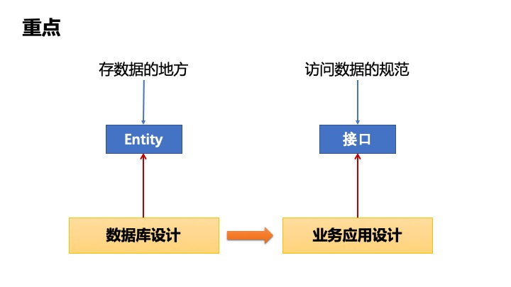  
之前是这样的：  


去掉 XML的定义 和 实现后，是这样的，如下图只有 Entity 和接口 ：  
  
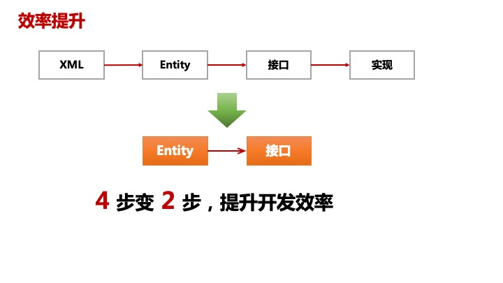  

# lightbatis 的设计理念是什么?
    命名规范和类型规范
## 什么是类型规范的编程
在使用 MyBatis 时已经使用了类型规范，基于类型的不同，便执行不同的操作，如 MyBatis 的 Mapper 方法中，如果方法参数是 ```org.apache.ibatis.session.RowBounds``` 类型，MyBatis 在执行过程中便自动执行逻辑分页的操作，这里就是使用不同的类型，执行不同的操作，在这里 数据类型也是一种规范，也是一种标记。**我们放大了这种操作，让他在更多的地方出现**，于是就有了 Lightbatis。            
如以下方法的定义：
```java
/**
* 根据参数 id 获取单个 Member 对象。
* 相当于执行的SQL 是 select * from member where id = ?
*/
Member getMember(Long id);
```
从以上方法的定义中，我们分析可知：方法的参数``` Long id ``` 可以表达这几个意思。1、参数的类型 Long。 2、 参数的名称 id。 3、 参数的值。   
如果我们做以下约定：1、参数类型是 Long 类型，只能出现在查询条件里。 2、参数名称 id 等于数据库列名称。 3、参数的值等于本次查询的约束条件。如果本次操作 id 输入值是 5，那么可以表达的意思是 ``` id = 5 ```  
基于此我们可以把返回值、查询条件、排序条件、分页条件等都定义起来。使用程序员最熟悉的方法来定义方法。  

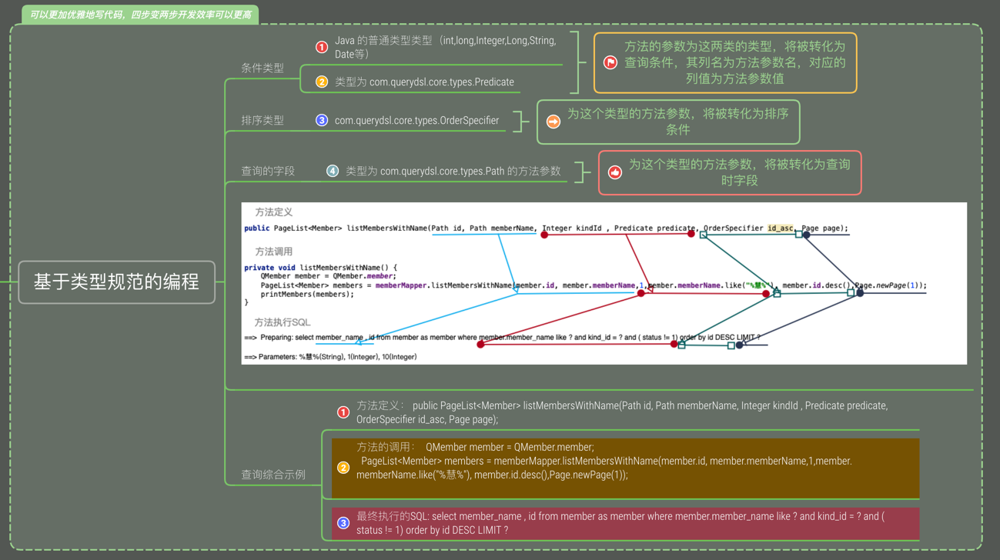  

# Lightbats 的使用步骤是什么？
    1. 根据规范定义接口。
    2. 使用接口。
    
## 关于表 -> 实体类 -> Mapper 之间的关联关系  
在日常的数据库访问的操作中，我们经常遇到三个对象，分别是： 数据库表、实体类、 数据访问的 Mapper 类，以下图：  
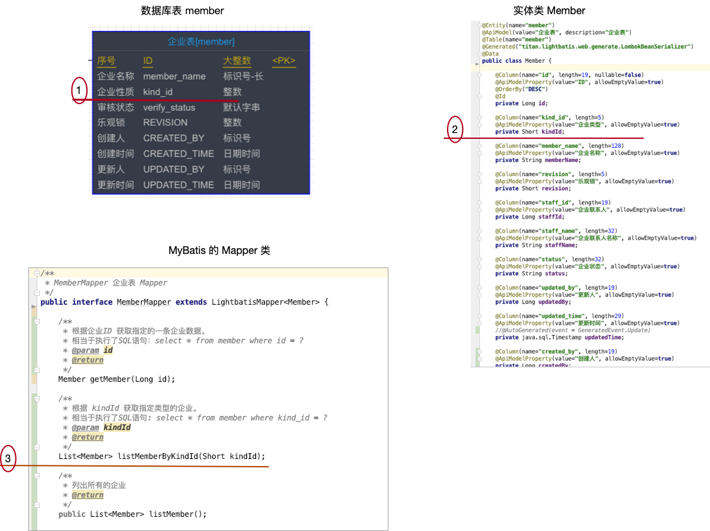  

图中：1处的表结构中的列名 kind_id , 第2处的实体类Member 的属性 kindId 是通过驼峰命名转化过来的，同时@Column 的注释也指定了列名为 kind_id, 第3处的 listMemberByKindId 方法中的参数 kindId 与 Member 类的属性 kindId 同名且同类型。  
由此他们三者之间存在着一系列的关联关系。我们就是把这种关联关系通过规范规定下来，形成默认的开发规则，基于这种常见的规则，便形成了统一数据访问的应用工具。
    
通过分析我们得到以下结论：  
    **基于驼峰命名的规范通过属性、参数的名称形成表、实体类、Mapper 之间的关联关系。** 以上图为例
    3处的 listMemberByKindId 方法 {kindId 参数} = {Member 属性 kindId} = {member 表 kind_id 列}。

Mapper 的执行过程 

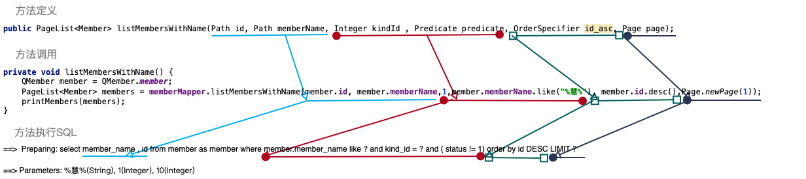  

代码：
``` List<Member> listMemberByKindId(Short kindId)``` 所表达的意思就是
``` select * from member where kind_id = ? ``` 其中 kind_id = kindId, kindId 的值就是方法中 kindId 的值。基于此我们可以做以下的约定：  


一、**SQL 查询条件约定**  
    a) 简单类型  
        1. 作用在 Mapper 方法的参数上.     
        2. 类型为Java 的普通类型。（int,long,Integer,Long,String,Date等）   
        3. 参数的名称与实体类的属性名称相同。  
    b) 指定类型  
        1. 作用在 Mapper 方法的参数上  
        2. 类型为 com.querydsl.core.types.Predicate 如： ``` member.id.gt(1L).and(member.memberName.like("%慧慧慧%")) ```  
    c) 混合类型  
        1. 作用在 Mapper 方法的参数上  
        2. 可以是以上 a,b 两处的参数。  
         
二、 **SQL 查询字段约定**  
    类型为 com.querydsl.core.types.Path 的方法参数

三、 **SQL 排序字段约定**  
     类型为 com.querydsl.core.types.OrderSpecifier 的方法参数

# lightbatis 执行过程全貌  

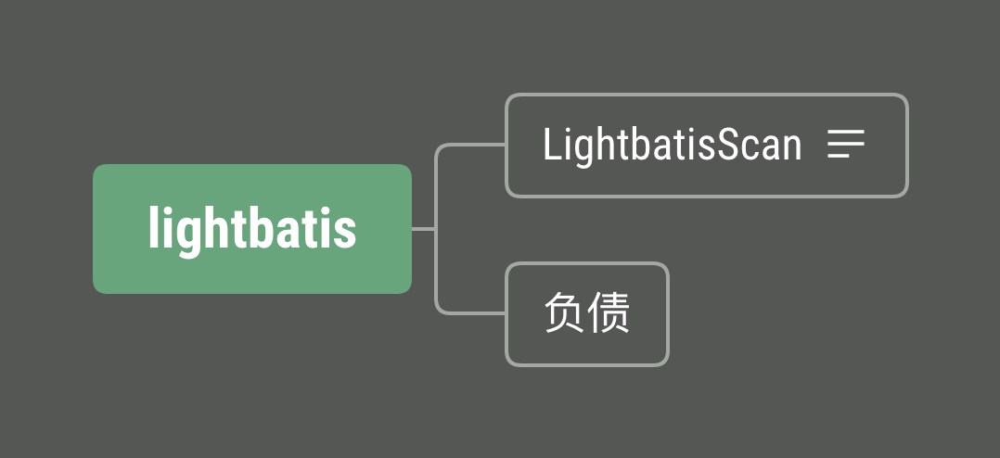  


# 使用 Lightbatis, 使用 Maven 加入以下配置
```mxml
<dependency>
  <groupId>com.github.lightbatis</groupId>
  <artifactId>lightbatis-core</artifactId>
  <version>1.0.1-SNAPSHOT</version>
</dependency>
```
如果使用控制台，加入以下配置
```mxml
<dependency>
  <groupId>com.github.lightbatis</groupId>
  <artifactId>lightbatis-web</artifactId>
  <version>1.0.1-SNAPSHOT</version>
</dependency>
```


# Mapper 的定义
1. 定义你自己的 Mapper 的接口 并且 扩展 LightbatisMapper 接口。
2. Mapper 接口必须指定泛型类型为本接口要操作的实体类。
3. LightbatisMapper 接口默认有以下几个方法：

# Entity 的定义 


Mapper 的定义示例：
```java

/**
 * MemberMapper 企业表 Mapper
 */
public interface MemberMapper extends LightbatisMapper<Member> {

    /**
     * 根据企业ID 获取指定的一条企业数据。
     * 相当于执行了SQL语句：select * from member where id = ?
     * @param id
     * @return
     */
    Member getMember(Long id);

    /**
     * 根据 kindId 获取指定类型的企业。
     * 相当于执行了SQL语句: select * from member where kind_id = ?
     * @param kindId
     * @return
     */
    List<Member> listMemberByKindId(Integer kindId);

    /**
     * 列出所有的企业
     * @return
     */
    public List<Member> listMember();


    /**
     * SELECT id,member_name FROM member where kindId = ? ORDER BY id asc OFFSET ? LIMIT ?
     *
     * @param kindId
     * @param id
     * @param memberName
     * @return
     */
    public PageList<Member> listMembers(Path id, Path memberName, Short kindId, OrderSpecifier id_asc, Page page);

    /**
     * SELECT id,member_name FROM member where kindId = ? and {predicate} ORDER BY id asc OFFSET ? LIMIT ?
     *
     * @param kindId
     * @param id
     * @param memberName
     * @return
     */
    public PageList<Member> listMembersWithName(Path id, Path memberName, Short kindId , Predicate predicate, OrderSpecifier id_asc, Page page);

    /**
     * select * from member where kindId = ? and ${predicate} order by id asc OFFSET ? LIMIT ?
     * @param kindId
     * @param predicate
     * @param id_asc
     * @param page
     * @return
     */
    public PageList<Member> listAllMembers(Short kindId, Predicate predicate, OrderSpecifier id_asc, Page page);

    /**
     * select * from member where ${predicates} order by id asc
     * @param id_asc
     * @param predicates
     * @return
     */
    public PageList<Member> listPredicatesMembers(OrderSpecifier id_asc, Predicate... predicates);//

    /**
     * select {paths} from member
     * @param paths
     * @return
     */
    public List<Member> listMemberFields(Path... paths);
}
```
调用时的代码:
```java

@Lightbatis()
@EnableLightbatisWeb()
@SpringBootApplication
public class SampleMapperApplication implements CommandLineRunner {

	@Autowired
	private MemberMapper memberMapper = null;

	public static void main(String[] args) {
		SpringApplication.run(SampleMapperApplication.class, args);
	}

	@Override
	public void run(String... args) throws Exception {

//		insertMember();
//		insertMemberWithId();
//		updateMember();
//		listMember();
//
//		Member member = getMember();
//		deleteMember();
//		queryMember();
//		listMembers();
//		listAllMembers();
//		listPredicatesMembers();
//		listMemberFields();
		listMemberByKindId();
		listMembersWithName();
	}

	private void listMemberByKindId() {
		List<Member> memberList = memberMapper.listMemberByKindId(1);
		printMembers(memberList);
	}
	private void queryMember() {
		QMember query = QMember.member;
		List<Member> members = memberMapper.query(query.kindId.eq(1));
		for (Member member : members) {
			System.out.println(member);
		}
	}
	private void selectMember() {
		QMember member = QMember.member;
		memberMapper.listMembers(member.id, member.memberName, 1, member.id.asc(),new Page(1,10));
	}
	private void insertMember() {
		Member member = new Member();
		int count = 1;
		for (int i=0;i < count; i++ ){
			//member.setId(new Long(250 + i));
			member.setMemberName("慧 20191110 " + i);
			member.setKindId(1);
			memberMapper.insert(member);
			System.out.println(" insert id " + member.getId());
		}
	}

	private void insertMemberWithId() {
		Long id = 643173508322426880L;
		Member member = memberMapper.getMember(id);
		if (member == null) {
			member = new Member();
		} else {
			return;
		}

		member.setId(id);
		member.setMemberName("INSERT 慧 20191110 AT " + System.currentTimeMillis());

		memberMapper.insert(member);
	}

	private void updateMember() {
		Long id = 643173508322426880L;
		Member member = memberMapper.getMember(id);
		member.setId(id);
		member.setKindId(1);
		member.setMemberName("修改 慧 20191110 AT " + System.currentTimeMillis());

		memberMapper.updateByPrimaryKey(member);
	}

	private Member getMember() {
		Long id = 643173508322426880L;
		Member member = memberMapper.getMember(id);
		return member;
	}

	private void deleteMember () {
		Long id = 643173508322426880L;
		Member member = new Member();
		member.setId(id);
		int delCount = memberMapper.deleteByPrimaryKey(member);
		System.out.println("delete count = " + delCount);

		member = memberMapper.getMember(id);
		System.out.println(" member is null " + member);

	}

	private void listMember () {
		List<Member> members = memberMapper.listMember();
		for (Member member : members) {
			System.out.println(member);
		}
	}

	private void listMembers() {
		QMember member = QMember.member;
		List<Member> members =memberMapper.listMembers(member.id, member.memberName, 1, member.id.asc(), new Page(5,1));
		for (Member m : members) {
			System.out.println(m);
		}
	}

	private void listAllMembers() {
		QMember member = QMember.member;
		PageList<Member> members = memberMapper.listAllMembers(1, member.id.gt(1L).and(member.memberName.like("%慧慧慧%")), member.id.asc(),new Page(5,1));
		for (Member m : members) {
			System.out.println(m);
		}

		System.out.println("============= total size = " + members.getTotalSize());
	}

	private  void listPredicatesMembers() {

		QMember member = QMember.member;
		PageList<Member> members = memberMapper.listPredicatesMembers(member.id.asc(), member.memberName.like("%慧%"), member.kindId.eq(1));//
		printMembers(members);
	}

	private void listMemberFields() {
		QMember member = QMember.member;
		List<Member> members = memberMapper.listMemberFields(member.id, member.memberName, member.kindId);
		printMembers(members);
	}
	private void listMembersWithName() {
		QMember member = QMember.member;
		PageList<Member> members = memberMapper.listMembersWithName(member.id, member.memberName,1,member.memberName.like("%慧%"), member.id.desc(),Page.newPage(1));
		printMembers(members);
	}
	private void printMembers(List<Member> members) {
		for (Member m : members) {
			System.out.println(m);
		}
		if (members instanceof  PageList) {
			PageList pageList = (PageList)members;
			System.out.println("=========== total size = " + pageList.getTotalSize());
		}
	}


}
```


## 关于类型规范


# lightbatis 统一数据访问层
lightbatis 统一数据层访问工具包，是在 Mybatis 的基础上，基于约定规范设计的增强功能集合。  
基于规范的约定，不需要添加任务的注释。

## 执行过程及原理
    1. 自定义 Lightbatis  注释，同时默认 Mapper 的接口是 LightbatisMapper
    2. Lightbatis 注释会 @import  LightbatisScannerRegistrar 扫描注册类。
    3. LightbatisScannerRegistrar 类 指定 factoryBean 为 LightbatisFactoryBean
    4. LightbatisScannerRegistrar 类 扫描到所有接口为 LightbatisMapper 的接口，该接口默认实现将由 LightbatisFactoryBean 代理
    5. LightbatisFactoryBean 默认继承了 SqlSessionDaoSupport, 在 checkDaoConfig 方法，先有默认实现检查原来 Mybatis 的默认实现
    6. LightbatisFactoryBean 的 checkDaoConfig 方法中，如果有 Mybatis 没有实现的方法，由 Lightbatis 来实现。
    7. Lightbatis 实现的方法是，将没有系统默认注释(@Select, @Insert, @Update, @Delete, @SelectProvider, @InsertProvider, @UpdateProvider, @DeleteProvider )的方法，转化成 MappedStatement 并注册到 MyBatis 的 Configuration 中去。
    
## Lightbatis

  

`
@Lightbatis()
`
## 使用上的一些约定
## SpringBoot 环境上使用 lightbatis 
    在 SpringBoot 的启动类上添加 @Lightbatis() 注释即可，如下：
```java
@Lightbatis()
@EnableLightbatisWeb()
@SpringBootApplication
public class SampleMapperApplication
```
### insert 操作
与实体类相关的注释说明  
@Id 与ID相关的操作
```java
    @Id
    @ApiModelProperty(value="ID", allowEmptyValue=true)
    @Column(name="id", length=19, nullable=false)
    private Long id;
```
@AutoGenerated 列值的自动生成
```java
    @AutoGenerated
    @ApiModelProperty(value="创建时间", allowEmptyValue=true)
    @Column(name="created_time", length=29)
    private java.sql.Timestamp createdTime;
```
### update 操作

### select 操作

## 简便易用的可视化代码生成控制台
lightbatis 自带可视化的代码生成控制台，可以快速地生成 Entity, Mapper, Service 等代码。  
在你的工程使用 Maven 加入以下依赖：
```xml
<dependency>
  <groupId>com.github.lightbatis</groupId>
  <artifactId>lightbatis-web</artifactId>
  <version>1.0.1-SNAPSHOT</version>
</dependency>
```
启动你的 SpringBoot 应用，和你应用同一个端口下可以直接访问，如 application.yml 中定义接口为 8082, 可以直接 http://localhost:8082/dal.html 访问  ：
```yml
server:
  port: 8082
```
会出现以下界面   
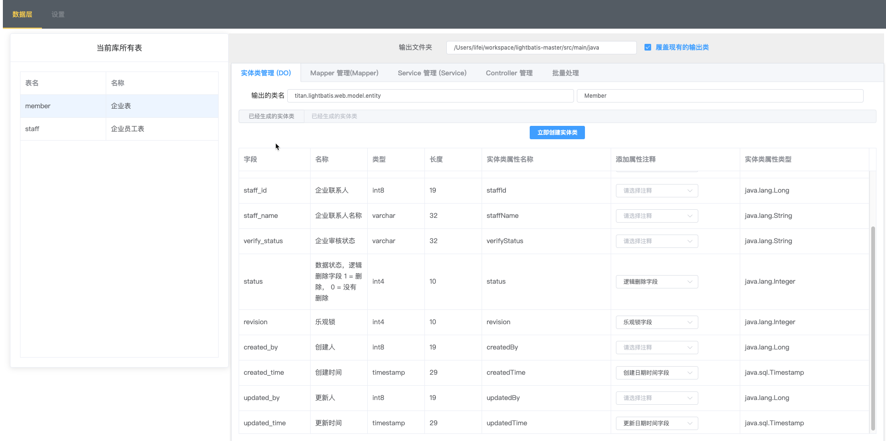  
生成 Mapper 类代码  
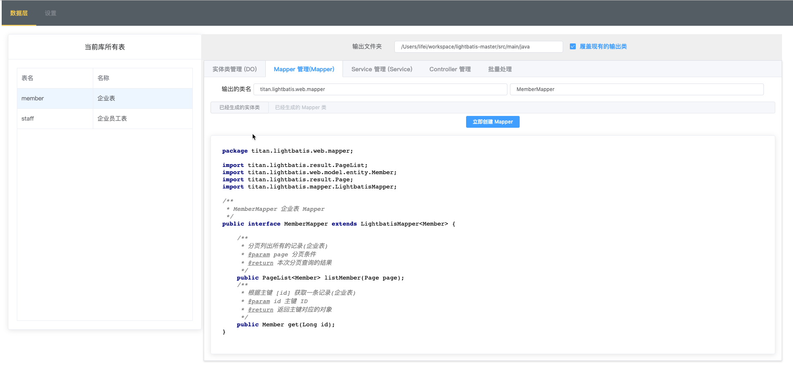  
生成 Service 类代码  
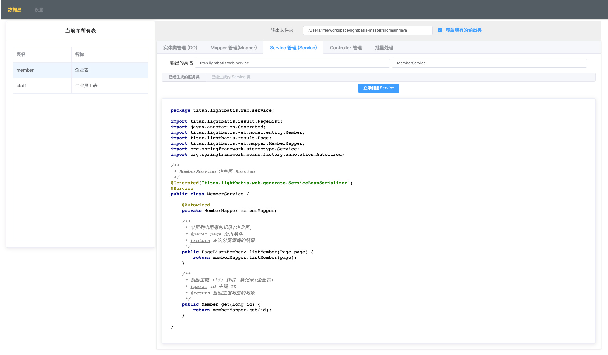  
批量生成  
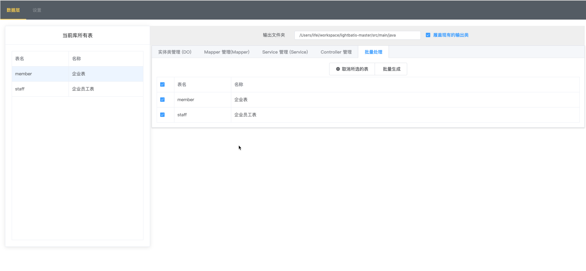  


## 相关工程结构


## 相关技术点
### 使用 handlebars 用来动态生成 MyBatis SQL  

Handlebars https://handlebarsjs.com/guide/